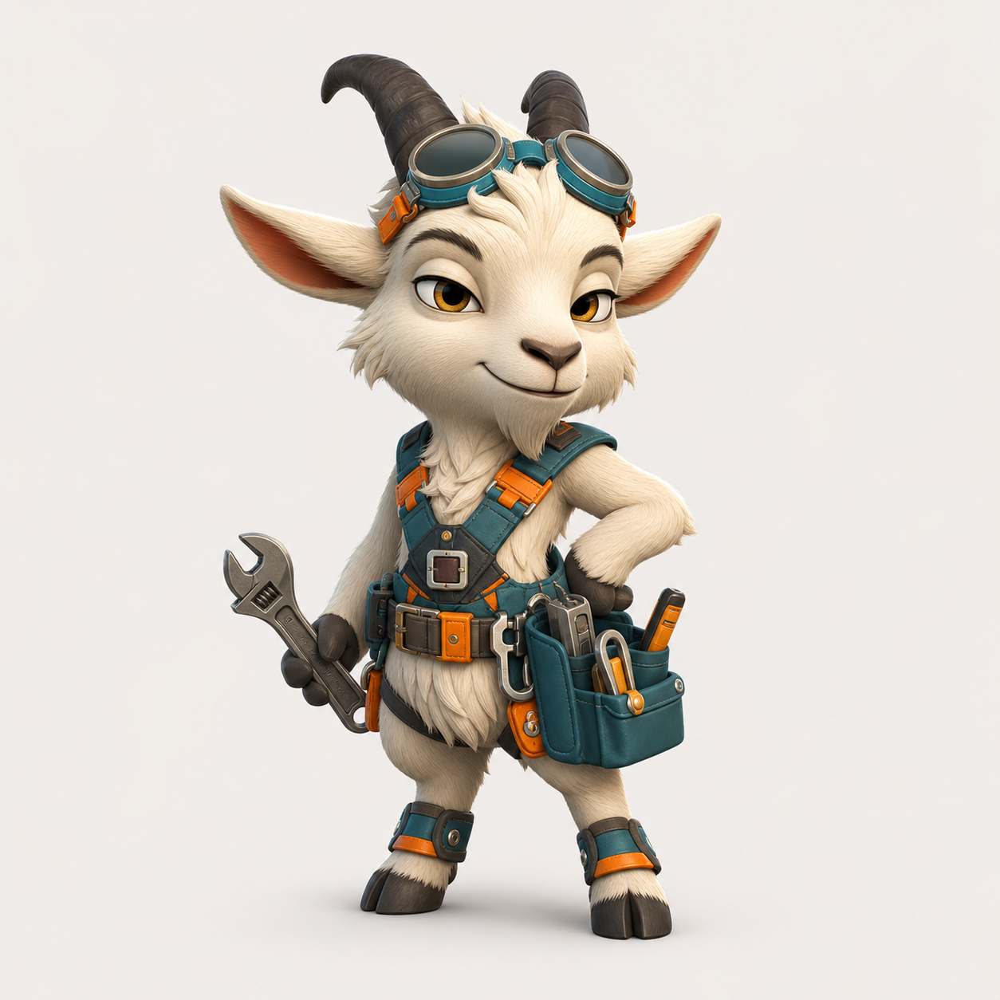

# gantry-buddy

Gantry Buddy is a Gantry-flavored fork of Anthropic's `claude-desktop-buddy`
firmware for the M5StickC Plus. It keeps the Claude Hardware Buddy BLE
protocol intact, then changes the device identity, boot copy, on-device
credits, and default pet naming so the stick feels like part of the Gantry
tooling setup.

The firmware displays session state, recent messages, permission prompts,
and approval controls on a small desk device. It sleeps when nothing is
connected, wakes when session data arrives, gets impatient when an approval
prompt is waiting, and lets you approve or deny from the stick.

The BLE advertisement intentionally still starts with `Claude`: current
Claude desktop builds filter the Hardware Buddy picker by that prefix. This
fork advertises as `Claude-GTxxxx` so it remains discoverable while being
easy to distinguish from stock firmware.

<p align="center">
  
  <br>
  
</p>

## Hardware

The firmware targets ESP32 with the Arduino framework. As written, it
depends on the M5StickCPlus library for the display, IMU, and button
drivers.

## Flashing

Install
[PlatformIO Core](https://docs.platformio.org/en/latest/core/installation/),
then:

```bash
pio run -t upload
```

For the M5Stick currently used with this fork:

```bash
pio run -t upload --upload-port /dev/cu.usbserial-7952330CF0
```

If you're starting from a previously-flashed device and want a clean state:

```bash
pio run -t erase && pio run -t upload
```

Once running, you can also wipe everything from the device itself: **hold A
-> settings -> reset -> factory reset -> tap twice**.

## Pairing

To pair the device, enable developer mode in Claude Desktop or Claude Code
Desktop: **Help -> Troubleshooting -> Enable Developer Mode**. Then open
**Developer -> Open Hardware Buddy...**, click **Connect**, and pick the
`Claude-GTxxxx` device from the list.

macOS will prompt for Bluetooth permission on first connect. Grant it. Once
paired, the bridge auto-reconnects whenever both sides are awake.

If discovery is not finding the stick:

- Make sure it is awake with any button press.
- Check the stick's settings menu and confirm Bluetooth is on.
- If the stick was factory reset, remove the old Bluetooth pairing on the
  Mac and pair again.

## Controls

|                         | Normal               | Pet         | Info        | Approval    |
| ----------------------- | -------------------- | ----------- | ----------- | ----------- |
| **A** (front)           | next screen          | next screen | next screen | **approve** |
| **B** (right)           | scroll transcript    | next page   | next page   | **deny**    |
| **Hold A**              | menu                 | menu        | menu        | menu        |
| **Power** (left, short) | toggle screen off    |             |             |             |
| **Power** (left, ~6s)   | hard power off       |             |             |             |
| **Shake**               | dizzy                |             |             | -           |
| **Face-down**           | nap (energy refills) |             |             |             |

The screen auto-powers-off after 30 seconds of no interaction, except while
an approval prompt is up. Any button press wakes it.

## ASCII Pets

Eighteen pets ship with the firmware, each with seven animations: sleep,
idle, busy, attention, celebrate, dizzy, and heart. Use **settings -> ascii
pet** to cycle them. Choice persists to NVS.

## GIF Pets

If you want a custom GIF character instead of an ASCII pet, drag a character
pack folder onto the drop target in the Hardware Buddy window. The desktop
app streams it over BLE and the stick switches to GIF mode live. **Settings
-> delete char** reverts to ASCII mode.

A character pack is a folder with `manifest.json` and 96px-wide GIFs:

```json
{
  "name": "bufo",
  "colors": {
    "body": "#6B8E23",
    "bg": "#000000",
    "text": "#FFFFFF",
    "textDim": "#808080",
    "ink": "#000000"
  },
  "states": {
    "sleep": "sleep.gif",
    "idle": ["idle_0.gif", "idle_1.gif", "idle_2.gif"],
    "busy": "busy.gif",
    "attention": "attention.gif",
    "celebrate": "celebrate.gif",
    "dizzy": "dizzy.gif",
    "heart": "heart.gif"
  }
}
```

State values can be a single filename or an array. Arrays rotate each time a
loop ends, which is useful for an idle activity carousel.

GIFs are 96px wide; height up to about 140px stays on a 135x240 portrait
screen. Crop tight to the character because transparent margins waste screen
space and shrink the sprite. `tools/prep_character.py` handles the resize.

The whole folder must fit under 1.8MB. `gifsicle --lossy=80 -O3 --colors 64`
typically cuts 40-60%.

See `characters/bufo/` for a working example. For faster USB iteration,
`tools/flash_character.py characters/bufo` stages it into `data/` and runs
`pio run -t uploadfs`.

## Gantry Bridge

`tools/gantry_bridge.py` is the host-side layer for sending Gantry status to
the stick over USB serial. It watches `~/.gantry/runs.jsonl` and
`~/.gantry/activities.jsonl`, converts recent model/tool activity into the
buddy heartbeat JSON, and streams it to the firmware.

```bash
python3 tools/gantry_bridge.py --port /dev/cu.usbserial-7952330CF0
```

If `python3` does not have `pyserial`, use PlatformIO's bundled Python:

```bash
/opt/homebrew/Cellar/platformio/6.1.19_2/libexec/bin/python tools/gantry_bridge.py --port /dev/cu.usbserial-7952330CF0
```

For a no-device sanity check:

```bash
python3 tools/gantry_bridge.py --once --dry-run
```

See [docs/gantry-bridge.md](docs/gantry-bridge.md) for the integration shape.

## The Seven States

| State       | Trigger                     | Feel                        |
| ----------- | --------------------------- | --------------------------- |
| `sleep`     | bridge not connected        | eyes closed, slow breathing |
| `idle`      | connected, nothing urgent   | blinking, looking around    |
| `busy`      | sessions actively running   | sweating, working           |
| `attention` | approval pending            | alert, LED blinks           |
| `celebrate` | level up every 50K tokens   | confetti, bouncing          |
| `dizzy`     | you shook the stick         | spiral eyes, wobbling       |
| `heart`     | approved in under 5 seconds | floating hearts             |

## Project Layout

```text
src/
  main.cpp       - loop, state machine, UI screens
  branding.h     - Gantry product strings and BLE compatibility prefix
  buddy.cpp      - ASCII species dispatch and render helpers
  buddies/       - one file per species, seven animation functions each
  ble_bridge.cpp - Nordic UART service, line-buffered TX/RX
  character.cpp  - GIF decode and render
  data.h         - wire protocol and JSON parse
  xfer.h         - folder push receiver
  stats.h        - NVS-backed stats, settings, owner, species choice
characters/      - example GIF character packs
tools/           - generators and converters
docs/            - mascot, bridge notes, and hardware screenshots
```

## Upstream

This fork tracks Anthropic's reference firmware and protocol documentation:
<https://github.com/anthropics/claude-desktop-buddy>.

The BLE API is only available when the desktop apps are in developer mode.
It is intended for makers and developers and is not an officially supported
product feature.
